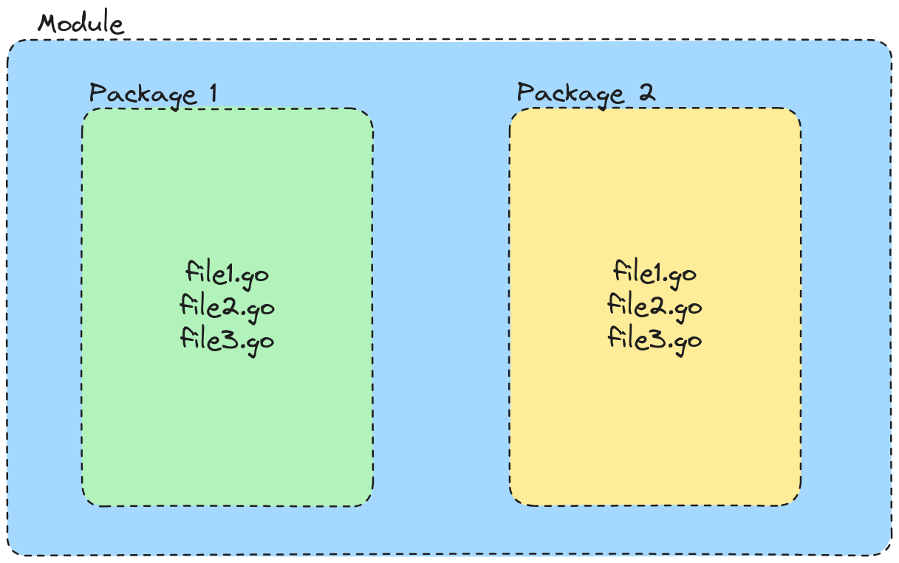
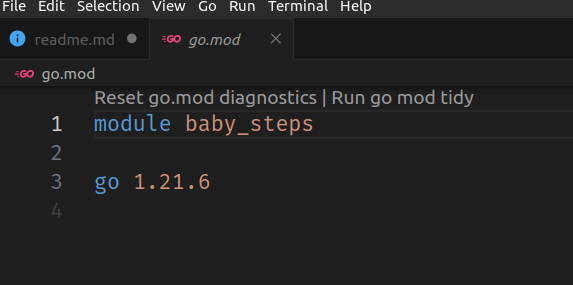
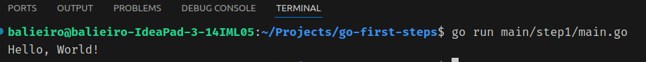

# My Baby Steps with Go

This repo is the result of my first time learning Go basics sintax and operations.


## First things to Know

- Statically and StronglyTyped
- Is Compiled
- Built-in Concurrency
- Simplicity by design
- Garbage Collector

## Modules and Packages

**Package** is just a folder that contains a collection of go files and a Collection of packages is known as a **Module**




A new project in Go (which is just a new module) can be done by

```bash
go mod init baby_steps
```

This creates a new file called go.mod that contais the module name and the go version that you are using




To our first step lets create a directory `main/step1` the create a file called `main.go`, so the file structure look like this:
```text
.
├── go.mod
├── main
│   └── step1
│       └── main.go
```

Inside our `main.go` let's start coding.
Remember that a go file needs to be inside a package.

so the first line that we're gonna write is

```go
package main
```

and all the files inside this folder should have the same package name. Go docs give some package name guidelines [here](https://go.dev/blog/package-names).

This package name `main` is important because tells the go compiler the entrypoint of our applications is in this file.

With that, the go compiler will look for the `main` function. which is required for packages with the `main` name.

If we had another module called `potato` it would not need a `potato` function. This is only for `main` package.

Ok, lets create out main function.

## Functions

Functions in go are defined with the `func` keyword followed by the `name of the function` with its parameters beteween parenthesis. The block code of the function are inside curly-braces. 
This will be something like this:

```go
func main() {
    //function code goes here 
}
```
 ## The famous *Hello, World*
Lets import the `fmt` module to help us print something in the terminal and then use it in the `main` function to call `Println` command. You have to use all the modules that you import, because the go compiler will slap you face if you have unused imports

 ```go
import "fmt"

func main() {
    fmt.Println("IDon'tHaveAGirlfriend")
}
```

Ok then, lets run this function with:
```bash
# this will create a new file called main.go
go build main/step1/main.go
#now we just call the created file
./main
```

Or you can just:

```bash
#This will build and execute your code in one command
go run main/step1/main.go
```

And that is it, we've crated out First Go code. Congratulations, I think:




## Variable declarations
They are declared starting with `var` keyword, followed by the variable name and the type.
And just like the imports, the Go compiler scream if you have unused variables.

If you do set the value of the var when declarating one, Go will set default values.

If you are lazy, Go can infer the type and even let you remove the keyword `var` if you use `:=`

```go
func main() {
	var potatoQuantity int = 666
	fmt.Println(potatoQuantity)
    //666
    var anotherPotato int
	fmt.Println(potatoQuantity)
    // 0

    var grape = 0 // now this a int

    anotherGrape := 0 //  shortest delcaration possible

    ant, anotherAnt, uncleAnt := 0


}
```
## Types

### Some numbers

We have multiple `int` types.
Some like:
 `int8`, `int16`, `int32`, `int64`: this defines the size of the number that will be stored in the memory.
  Lets say that you want to use int8, which can store at max: number 127. If you add + 1 (now 128) the compiler will throw an overflow error. By default, if you put just `int` it will assume at least  32bits value, based on you system.

So, if you have something like this:
```go
package main

import "fmt"

func main() {
	var potatoQuantity int8 = 128 //exceeds the max value of the type
	fmt.Println(potatoQuantity)
}
```
You will receive the error
```text
 cannot use 128 (untyped int constant) as int8 value in variable declaration (overflows)
 ```

 But this occurs only in compilation time. At execution time, if you do it at execution time, you will see something like this
```go
func main() {
	var potatoQuantity int8 = 127
    // adding the value at runtime
	fmt.Println(potatoQuantity + 1)
    // >>> -128
}
```

So, be aware of this behaviour to avoid nights of debbuging. You`re welcome.

Another typw of int is a unsigned int: `uint` that will allow you to store all positive values possible for the int type. You canhave a comination like: uint, uint32, unint8 etc 

For floating numbers we have: `float32` and `float64`. as the in types, be aware of the data types because fi the value you stored in the type exceeds you will get the errors and weird behaviour that we saw previously.

As for arithmetic operations, you only can do it with var of the same type. You cannot do `float32` + `int32`. But you can do a type casting to solve like:
```go
func main() {
	var potatoQuantity int32 = 127
	var potatoPrice float32 = 12.2
	fmt.Println(potatoQuantity * int32(potatoPrice))
}
```

### strings
strings are stored in the `string` type 😛. And can declared with double quotes or back quotes.

Double quotes are for single lines, if you want to break a line you can add `\n`. like
```go
fmt.Println("Break the \nline")
```

With backquotes you can just hit enter and you just fine:
```go
fmt.Println(`Break the 
    line`
)
```

For concatenations just:
```go
fmt.Println("Concate"+"nated")
```

Be aware o how Go count the size of string. you can use the built-in `len`
```go
	fmt.Println(len("four"))
    // 4
	fmt.Println(len("fours"))
    // 5
	fmt.Println(len("©"))
    // 2
	fmt.Println(len("©©"))
    // 2
```

But this fucntion calculate it based on its byte size. Since Go uses the UTF-8 enconding. So any char outside of the vanilla ASCII table are stored with more than a single byte

To avoid this pain you can use the built-in: `unicode/utf8` and call `utf8.RuneCountInString`:

```go
package main

import (
	"fmt"
	"unicode/utf8"
)

func main() {
	fmt.Println(len("four"))
    //4
	fmt.Println(len("fours"))
    //5
	fmt.Println(utf8.RuneCountInString("©"))
    //1
	fmt.Println(utf8.RuneCountInString("©©"))
    //2
}
```

### booleans

just do 
```go
var boolean bool = true

